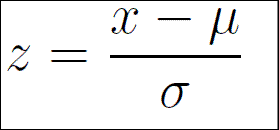
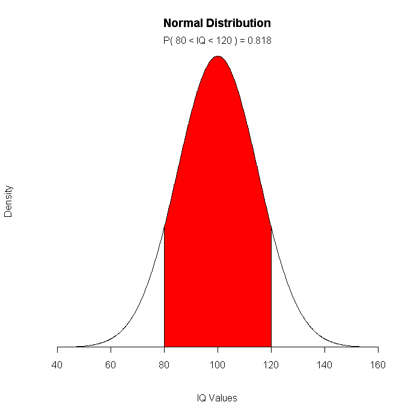

# Normal Distribution & Z-Scores Lab

## Problem Description
In this lab, we'll learn about how to calculate and interpret Z-scores with the Normal and Standard Normal Distribution. 

### Objectives
* Transform a normally distributed sample or population to the Standard Normal Distribution
* Calculate and interpret the Z-score for a given value in a Standard Normal Distribution
* Use Z-scores to make inferences about a normally distributed dataset
* Use Cumulative Density functions to infer the probability mass of given samples

### Z-Scores and The Normal Distribution

Z-scores are one of the main reasons the Normal Distribution is so useful.  Z-scores represent an easy way for us to quickly tell how many standard deviations a value is from the mean, which empowers us to quickly answer questions such as the probability of a specific value (_point probablility_), or the percentage of values in the dataset greater than or less than a given value (_cumulative probability_).  

Take a look at the following diagram:

<center>
[image source](http://www.statisticshowto.com/probability-and-statistics/hypothesis-testing/t-score-vs-z-score/)</center>

### Interpreting a Z-Score

Important things to note about the diagram above:

* 100% of the data is found under the "bell curve" line.

* The distribution is symmetrical.  

* 99.7% of all data falls within 3 standard deviations of the mean.  

Z-scores are just a measure of how many standard deviations away from the mean it is.  If a Z-score is positive, then we know it is greater than the mean, whereas values smaller than the mean will have a negative Z-score.  

Since the distribution is symmetrical, we can also easily calculate the **_Cumulative Density_**.   We can use this to tell us what percentage of the population falls to the left or the right of a given value.

### Calculating a Z-score

Recall that the formula for calculating a Z-score for a given value is: 

<center></center>

Where:

$x = value$

$\mu = Population\ Mean$

$\sigma = Population\ Standard\ Deviation$ 

In the cell below, write a function that takes in an array of data and a value and returns the z-score for that value.  


```python
# Run this cell to import everything we'll need for this lab
import numpy as np
import scipy
import matplotlib.pyplot as plt
%matplotlib inline
import seaborn as sns
# Do not change the random seed, or you'll break things!
np.random.seed(0)
```


```python
def calculate_z_score_from_data(data, value):
    pass

test1 = np.random.normal(5, 3, 10)
print(calculate_z_score_from_data(test1, 5)) # -0.7631465574632231
print(calculate_z_score_from_data(test1, 1)) # -2.14186850501324
```

### Calculating Z-score with Mean and Standard Deviation Values

Obviously, if we already know the standard deviation and mean of a sample or population, computing the z-score for a given value becomes a simple task. 

In the cell below, write a function that takes in arguments for mean, standard deviation, and a value, and returns the z-score for that value.  


```python
def calculate_z_score_from_values(mean, std, value):
    pass

print(calculate_z_score_from_values(5, 1, 4)) # -1
print(calculate_z_score_from_values(5, 1, 6.5)) # 1.5
```

### Normal vs. Standard Normal Distribution

Often, we'll want to **_normalize_** an entire dataset by converting all values to their corresponding z-scores.  In statistical terms, this is converting a normally distributed dataset to the **_Standard Normal Distribution_**.  The Standard Normal Distribution always has a mean of zero, and standard deviation of 1.  In essence, by normalizing a dataset, we are just shifting it.  

It is important to note that in order to transform a dataset to standard normal, it must first be normally distributed.  If our dataset is not normally distributed, we can still do this by taking advantage of the **_Central Limit Theorem_**--more on this in the next lab.  

For now, we'll concern ourselves with converting normally distributed datasets into Standard Normal form. 

In the cell below, write a function that takes in an array of normally distributed data and returns a normalized version of the same dataset, where all values have been converted to their corresponding z-scores.  


```python
def normalize(data):
    pass

normalize(test1) 
```

**_Expected Output:_**
```[-1.2266644368964434,
 1.1834768969042264,
 -0.5037146822591747,
 -1.7626173670982563,
 0.4033482369241084,
 1.2613410989475338,
 0.5813305883085411,
 1.024794279174945,
 -0.7358579324798615,
 -0.2254366815256156]
 ```

### Probability Density & Cumulative Density Functions

Often times, it's preferable to know what percentage of the data fits within a certain set of constraints--for instance, questions such as:

* What percentage of people are between the 5'9" and 6'0" tall?
* What percentage of people have a shoe size of 10?
* What percentage of people have an IQ of 115 or higher?
* What percentage of tires will fail before [x] miles?

These are all questions that can be answered using the normal distribution and **_Density Functions_**.  Before computers, calculating the cumulative density would require finding the z-score of a value and then using an unweildy formula or a massive reference table. Luckily, we can make use of the `scipy.stats` package to make things easy for us!

Note that the concept of probability density is not limited only to normally distributed data--however, because the normal distribution is so well studied, it is something that is used quite often.  With only the mean and standard deviation, we can quickly know exactly how likely something is in a distribution.  

#### Practice Problem 1: Cumulative Density

To answer questions about what percentage of the data is to the left of a specific value, we use **_Cumulative Density Functions_**.

In the cell below, use the cumulative density function (cdf, for short) included in [scipy](https://docs.scipy.org/doc/scipy-0.16.1/reference/generated/scipy.stats.norm.html) to answer the following question:

The mean height of adult men is 5'10", with a standard deviation of four inches.  What percentage of adult males are 6'1" or shorter?


```python
men_mean = None  # inches
men_std = None # inches
percent_shorter = None

print("{:.4}% of adult males are 6'1\" or shorter".format(percent_shorter * 100)) # answer: 77.34%
```

#### Practice Problem 2: Survival Function

To calculate what percentage of the data is to the right of a value, we can use a **_Survival Function_**, which is also equivalent to `(1 - cdf)`.  

In the cell below, use the survival function (sf, for short) included in scipy to answer the following question:

The mean height for women is 5'4", with a standard deviation of 3.5 inches.  What percentage of women are 5'8" or taller?


```python
women_mean = None
women_std = None
percent_taller = None

print("{:.4}% of adult females are 5'8\" or taller".format(percent_taller * 100)) # answer: 12.65%
```

#### Practice Problem 3: Probability Mass of a Range of Values

Often times, we'll want to know the probability mass of values in a certain range.  For instance, what if we wanted to know what percentage of people have an IQ between 80 and 120?  It helps to visualize this to formulate our problem--what percentage of the area under the curve is red?

<center></center>

The mean IQ is 100, with a standard deviation of 15.  Using the functions you learned above, figure out a way to calculate what percentage of people fall between an IQ of 80 and 120.  


```python
lower_bound = None
upper_bound = None
probability_mass = None

print("{:.4}% of people have an IQ between 80 and 120".format(probability_mass * 100)) # answer: 81.76%
```

### Conclusion

In this lab, we learned how to:
* Transform a normally distributed sample or population to the Standard Normal Distribution
* Calculate and interpret the Z-score for a given value in a Standard Normal Distribution
* Use Z-scores to make inferences about a normally distributed dataset
* Use Cumulative Density functions to infer the probability mass of given samples
